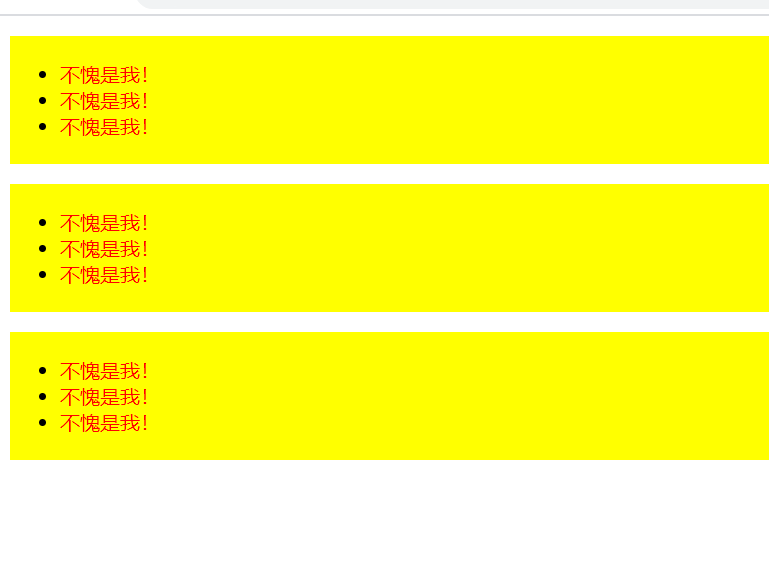

### 安装方式
下载 generateDOM.js 文件，通过脚本引入的方式来使用生成器
```html
<script src="generateDOM.js"></script>
```

### 生成器参数
- dom：这是一个 dom 字符串，由标签名+属性组成，必须使用双引号包含！因为字符串中需要单引号
- append：这是一个**节点**，生成器所生成的 DOM 将会追加到这个节点内，默认是 body

### dom 参数的关键字
```
.         表示添加一个 class
.[]       表示添加一个或多个 class，之间使用逗号分隔
#         表示添加一个 id
%{}       表示添加一个或多个属性，之间使用逗号分隔
@''       表示添加一个文本，必须有单引号！
*         表示生成的元素数量
>         表示元素的子元素
```

### 教程
- 生成一个 div 元素
```javascript
generateDOM("div")
```

- 生成一个带 class 的 div 元素
```javascript
generateDOM("div.myClass")
```

- 生成多个 class
```javascript
generateDOM("div.[class1, class2, class3]")
```
**[] 内不能出现引号！！！一定要是数组形式的写法**

- 生成一个带 id 的 div 元素
```javascript
generateDOM("div#myId")
```

- 生成一个包含其他属性的 div 元素
```javascript
generateDOM("div%{style: background-color: red, class: myClass}")
```
**{} 内不能出现引号！！！一定要是对象形式的写方法，键名: 键值，之间使用逗号分隔**

如果之前使用了 . 关键字生成 class，之后还使用 %{} 关键字生成 class，会合并

- 生成一个带文本的 div 元素
```javascript
generateDOM("div@'文本一定要加上单引号！！！'")
```
**文本一定要加上单引号！！！**

- 生成三个 div 元素
```javascript
generateDOM("div*3")
```

- 生成嵌套的 div 元素
```javascript
generateDOM("div > div")
```

- 把生成的 div 元素追加到 p 元素内
```javascript
generateDOM("div", document.createElement('p'))
```

### 来一盘大杂烩！
```javascript
generateDOM(`ul
            .uc1
            .[uc2, uc3]
            #ui1
            *3
            %{style: background-color: yellow; padding: 20px 40px}
                  >
            li
            *3
                  >
            span
            @'不愧是我！'
            %{style: color: red}`)
```

截图



**至于为啥子这样写嘞？一是因为清晰，二是为了表示关键字之间有没有空格啥的都无所谓，你把关键字以及值写对了，符合要求了就一切 OJBK**
